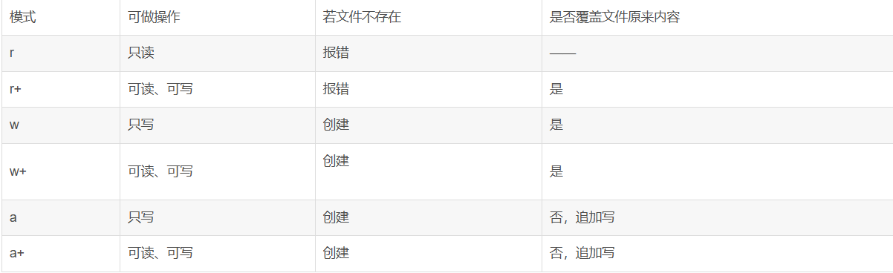

# 6_Python 文件操作：多角度分步讲解

## 模块1：基础核心——文件的打开与关闭

​	这是文件操作的入门，所有文件操作都必须先打开文件，操作完成后关闭文件，避免资源泄露。

### 1.1 核心函数：`open()` （打开文件）

`open()` 函数是Python操作文件的入口，用于创建一个**文件对象**（也叫文件句柄），后续所有对文件的读写操作都通过这个对象完成。

#### 语法格式

```Python

file_object = open(file, mode='r', encoding=None)
```

#### 关键参数解释

|参数|说明|
|---|---|
|`file`|必选参数，文件的**路径**（相对路径或绝对路径），字符串类型。|
|`mode`|可选参数，文件打开模式，默认值为 `'r'`（只读），后续详细讲解。|
|`encoding`|可选参数，文件的编码格式，**处理中文文件时必须指定**（推荐 `'utf-8'`），忽略该参数会使用系统默认编码（Windows默认GBK，Linux/Mac默认UTF-8）。|
### 1.2 核心方法：`close()` （关闭文件）

`file_object.close()` 用于关闭已打开的文件，释放操作系统分配的文件资源。

#### 基础示例（不推荐的写法，仅用于理解）

```Python

# 1. 打开文件（相对路径，当前目录下的 test.txt，只读模式，指定UTF-8编码）
f = open("test.txt", mode='r', encoding='utf-8')

# 2. 简单读取文件内容（后续模块详细讲解）
content = f.read()
print(content)

# 3. 关闭文件（必须执行，否则文件会被占用）
f.close()
```

### 1.3 更优方案：`with` 语句（自动关闭文件）

手动调用 `close()` 容易遗漏（比如代码抛出异常时，后续代码无法执行），`with` 语句会在代码块执行完毕后**自动关闭文件**，无需手动调用 `close()`，是Python文件操作的最佳实践。

#### 语法格式与示例（推荐写法）

```Python

# with 语句会自动管理文件资源，代码块执行完自动关闭文件
with open("test.txt", mode='r', encoding='utf-8') as f:
    content = f.read()
    print(content)
# 缩进结束后，文件已自动关闭，无需再写 f.close()
```

### 1.4 核心：文件打开模式（`mode` 参数）

这是基础中的重点，不同模式对应不同的操作权限，常见模式分为3类：**只读、只写、追加**，还有2个辅助模式 `b`（二进制模式）、`+`（读写模式）。

|模式|中文说明|核心特点|
|---|---|---|
|`'r'`|只读模式（默认）|1. 文件必须存在，否则报错<br>2. 只能读取文件内容，不能修改|
|`'w'`|只写模式|1. 文件不存在则创建新文件<br>2. 文件存在则**清空原有内容**，重新写入|
|`'a'`|追加模式|1. 文件不存在则创建新文件<br>2. 文件存在则在文件**末尾追加内容**，不会清空原有内容|
|`'rb'`|二进制只读模式|用于读取非文本文件（图片、视频、音频、压缩包等），无需指定 `encoding`|
|`'wb'`|二进制只写模式|用于写入非文本文件，无需指定 `encoding`|
|`'ab'`|二进制追加模式|用于追加非文本文件，无需指定 `encoding`|
|`'r+'`|读写模式|1. 文件必须存在<br>2. 可同时读取和写入文件，写入会覆盖原有内容（按指针位置）|
注意：二进制模式（带 `b`）操作的是 `bytes` 类型数据，不是字符串类型，处理文本文件时一般不用。



## 模块2：文本文件的读写操作

掌握了文件的打开/关闭后，接下来学习核心的读写操作，针对**文本文件**（`.txt`、`.py`、`.md` 等），主要分为「读取」和「写入」两类操作。

### 2.1 文本文件读取（3种常用方法）

所有读取方法都基于打开的文件对象，且仅在 `r`/`r+` 等可读模式下有效。

#### 方法1：`read(size)` —— 读取指定长度/全部内容

- `size`：可选参数，整数类型，指定读取的**字符数**（文本模式）或**字节数**（二进制模式）。

- 不指定 `size` 时，读取文件**全部内容**。

- 适合小文件，大文件读取会占用大量内存。

```Python

with open("test.txt", 'r', encoding='utf-8') as f:
    # 1. 读取前10个字符
    content1 = f.read(10)
    print("前10个字符：", content1)
    
    # 2. 读取剩余所有内容（文件指针会移动，不会重复读取）
    content2 = f.read()
    print("剩余内容：", content2)
```

#### 方法2：`readline()` —— 逐行读取

- 每次读取**一行内容**，返回字符串（包含行尾的换行符 `\n`）。

- 读取到文件末尾时，返回空字符串 `''`。

- 适合按行处理文件，节省内存，可用于大文件。

```Python

with open("test.txt", 'r', encoding='utf-8') as f:
    # 循环逐行读取，直到文件末尾
    while True:
        line = f.readline()
        if not line:  # 读取到末尾，退出循环
            break
        # strip() 去除行尾的换行符和空格，优化输出格式
        print("当前行：", line.strip())
```

#### 方法3：`readlines()` —— 读取所有行，返回列表

- 一次性读取文件**所有行**，返回一个列表，列表中的每个元素对应文件的一行内容（包含 `\n`）。

- 适合需要对所有行进行批量处理的场景，小文件适用，大文件会占用较多内存。

```Python

with open("test.txt", 'r', encoding='utf-8') as f:
    # 读取所有行到列表
    lines = f.readlines()
    print("所有行的列表：", lines)
    
    # 遍历列表，处理每一行
    for index, line in enumerate(lines):
        print(f"第 {index+1} 行：", line.strip())
```

#### 额外技巧：直接遍历文件对象（推荐，最简洁）

文件对象本身是可迭代对象，直接用 `for` 循环遍历，效果和 `readline()` 一致，且更简洁、更节省内存，是大文件逐行处理的最优解。

```Python

with open("test.txt", 'r', encoding='utf-8') as f:
    # 直接遍历文件对象，逐行读取
    for index, line in enumerate(f):
        print(f"第 {index+1} 行：", line.strip())
```

### 2.2 文本文件写入（2种常用方法）

所有写入方法都基于打开的文件对象，且仅在 `w`/`a`/`r+` 等可写模式下有效，写入完成后会自动缓存，如需立即生效可调用 `flush()` 方法。

#### 方法1：`write(str)` —— 写入字符串内容

- 接收一个**字符串**作为参数，将其写入文件。

- 返回值是写入的字符数。

- 不会自动换行，如需换行需手动添加 `\n`。

```Python

# 示例1：只写模式（清空原有内容，写入新内容）
with open("test.txt", 'w', encoding='utf-8') as f:
    # 写入单行内容
    f.write("Hello, Python 文件操作！\n")
    # 写入多行内容（手动加 \n 换行）
    f.write("这是通过 write() 方法写入的内容\n")
    f.write("这是第三行内容")

# 示例2：追加模式（在文件末尾追加内容，不清空原有）
with open("test.txt", 'a', encoding='utf-8') as f:
    f.write("\n\n这是追加的内容，不会覆盖原有内容")
```

#### 方法2：`writelines(iterable)` —— 写入可迭代对象（列表/元组等）

- 接收一个可迭代对象（列表、元组、字符串等），将其中的每个元素依次写入文件。

- 不会自动添加换行符，也不会对元素做额外处理，需手动准备格式。

```Python

with open("test.txt", 'w', encoding='utf-8') as f:
    # 准备要写入的列表（每个元素后手动加 \n 换行）
    lines = [
        "第一行内容\n",
        "第二行内容\n",
        "第三行内容"
    ]
    # 写入整个列表
    f.writelines(lines)
```

## 模块3：文件指针操作

在文件读写过程中，存在一个「文件指针」（可以理解为“光标”），它标记了当前操作的位置，掌握指针操作可以更灵活地控制文件的读写。

### 3.1 核心方法

|方法|说明|
|---|---|
|`tell()`|返回当前文件指针的位置（单位：字节，文本模式下对应字符的字节数）。|
|`seek(offset, whence)`|移动文件指针到指定位置，返回新的指针位置。|
### 3.2 `seek()` 方法参数详解

- `offset`：偏移量，整数类型，正数表示向后移动，负数表示向前移动（仅二进制模式支持负数偏移）。

- `whence`：参考位置，整数类型，可选3个值：

    1. `0`：默认值，参考文件**开头**位置，`offset` 必须为非负数。

    2. `1`：参考当前指针**所在位置**，仅二进制模式支持。

    3. `2`：参考文件**末尾**位置，仅二进制模式支持，`offset` 通常为负数（表示从末尾向前移动）。

### 3.3 示例（文本模式下的指针操作）

```Python

with open("test.txt", 'r+', encoding='utf-8') as f:
    # 1. 读取前5个字符，指针移动到第5个字符后
    content = f.read(5)
    print("读取的内容：", content)
    print("当前指针位置：", f.tell())
    
    # 2. 移动指针到文件开头（参考位置0，偏移量0）
    f.seek(0, 0)
    print("移动后指针位置：", f.tell())
    
    # 3. 在文件开头写入新内容（覆盖原有对应长度的内容）
    f.write("Hi! ")
    print("写入后指针位置：", f.tell())
```

## 模块4：高级操作——文件/目录管理

前面的操作都是针对「文件内容」，这个模块讲解「文件/目录本身」的管理（创建、删除、重命名、查看目录等），需要用到Python内置的 `os` 模块和 `os.path` 模块（或更简洁的 `pathlib` 模块，Python3.4+ 支持）。

### 4.1 必备前置：导入模块

```Python

# 导入 os 模块（核心）和 os.path 模块（路径处理）
import os
import os.path
```

### 4.2 目录操作（创建、查看、删除）

#### 1. 创建目录

- `os.mkdir(path)`：创建**单个一级目录**，如果目录已存在或父目录不存在，报错。

- `os.makedirs(path)`：创建**多级目录**（支持父目录不存在的情况），目录已存在时报错。

```Python

# 1. 创建单个目录（当前目录下创建 dir1 文件夹）
os.mkdir("dir1")

# 2. 创建多级目录（当前目录下创建 dir2 -> subdir1 -> subdir2 嵌套文件夹）
os.makedirs("dir2/subdir1/subdir2")
```

#### 2. 查看目录内容

- `os.listdir(path)`：返回指定目录下的所有文件和子目录，以列表形式返回。

- `os.walk(path)`：遍历指定目录下的所有文件和子目录（递归遍历），返回三元组 `(当前目录路径, 子目录列表, 文件列表)`。

```Python

# 1. 查看 dir2 目录下的内容
content = os.listdir("dir2")
print("dir2 下的内容：", content)

# 2. 递归遍历 dir2 目录下的所有内容（推荐，批量处理文件时常用）
for root, dirs, files in os.walk("dir2"):
    print(f"当前目录：{root}")
    print(f"子目录列表：{dirs}")
    print(f"文件列表：{files}")
    print("-" * 20)
```

#### 3. 删除目录

- `os.rmdir(path)`：删除**空的单个一级目录**，目录非空或不存在时报错。

- `os.removedirs(path)`：删除**空的多级目录**，从最内层向外删除，直到遇到非空目录为止。

```Python

# 1. 删除空目录 dir1
os.rmdir("dir1")

# 2. 删除空的多级目录 dir2/subdir1/subdir2（从内向外删除）
os.removedirs("dir2/subdir1/subdir2")
```

### 4.3 文件操作（重命名、删除）

#### 1. 重命名文件/目录

- `os.rename(old_name, new_name)`：将文件/目录从旧名称重命名为新名称，旧名称不存在时报错。

```Python

# 1. 重命名文件（test.txt -> new_test.txt）
os.rename("test.txt", "new_test.txt")

# 2. 重命名目录（dir2 -> new_dir2）
os.rename("dir2", "new_dir2")
```

#### 2. 删除文件

- `os.remove(path)`：删除指定文件，文件不存在时报错，**无法删除目录**。

```Python

# 删除 new_test.txt 文件
os.remove("new_test.txt")
```

### 4.4 路径处理（判断、拼接）

文件/目录操作中，路径处理是重点，避免因操作系统差异（Windows用 `\`，Linux/Mac用 `/`）导致的问题。

#### 1. 路径判断（常用）

- `os.path.exists(path)`：判断指定路径（文件/目录）是否存在，返回布尔值。

- `os.path.isfile(path)`：判断指定路径是否为**文件**，返回布尔值。

- `os.path.isdir(path)`：判断指定路径是否为**目录**，返回布尔值。

```Python

path = "new_dir2"
# 1. 判断路径是否存在
if os.path.exists(path):
    print(f"{path} 存在")
    # 2. 判断是否为目录
    if os.path.isdir(path):
        print(f"{path} 是目录")
    # 3. 判断是否为文件
    elif os.path.isfile(path):
        print(f"{path} 是文件")
else:
    print(f"{path} 不存在")
```

#### 2. 路径拼接

- `os.path.join(path1, path2, ...)`：自动根据操作系统拼接路径，避免手动写 `\` 或 `/` 导致的兼容性问题。

```Python

# 拼接路径（当前目录 -> new_dir2 -> subdir1 -> test.txt）
file_path = os.path.join("new_dir2", "subdir1", "test.txt")
print("拼接后的路径：", file_path)

# 后续可直接使用该路径操作文件
with open(file_path, 'w', encoding='utf-8') as f:
    f.write("通过拼接路径写入的内容")
```

## 模块5：进阶优化——大文件处理与编码问题

### 5.1 大文件处理（避免内存溢出）

当文件大小超过GB级别时，直接用 `read()` 或 `readlines()` 会将整个文件加载到内存，导致内存溢出，最优解决方案是：**用 ** **`for`** ** 循环直接遍历文件对象，逐行读取处理**。

```Python

# 处理大文件（示例：统计大文件的行数）
big_file_path = "big_file.txt"
line_count = 0

with open(big_file_path, 'r', encoding='utf-8') as f:
    # 逐行遍历，每次只加载一行到内存，节省内存
    for line in f:
        line_count += 1
        # 可在此处添加每行的处理逻辑（如筛选、分析等）

print(f"大文件 {big_file_path} 共有 {line_count} 行")
```

### 5.2 常见编码问题（解决中文乱码）

文件操作中最常见的问题是中文乱码，核心解决方案是：**打开文件时，明确指定编码格式为 ** **`utf-8`** **（或文件本身的编码格式）**。

- 写入中文时：用 `encoding='utf-8'` 打开文件，确保写入的中文被正确编码。

- 读取中文时：用文件本身的编码格式打开（通常是 `utf-8`，少数是 `gbk`），否则会抛出 `UnicodeDecodeError` 异常。

```Python

# 解决中文乱码：明确指定 encoding='utf-8'
with open("chinese.txt", 'w', encoding='utf-8') as f:
    f.write("这是中文内容，不会乱码")

with open("chinese.txt", 'r', encoding='utf-8') as f:
    content = f.read()
    print(content)
```

---

### 总结

1. 文件操作基础：优先使用 `with` 语句打开文件，自动关闭资源，核心打开模式为 `r`（只读）、`w`（只写清空）、`a`（追加）。

2. 文本文件读写：读取用「`for` 循环遍历文件对象」（大文件最优），写入用 `write()`（单行）或 `writelines()`（多行），需手动加 `\n` 换行。

3. 文件/目录管理：依赖 `os` 模块，路径拼接用 `os.path.join()` 保证兼容性，大文件处理需逐行读取避免内存溢出，中文乱码需指定 `encoding='utf-8'`。